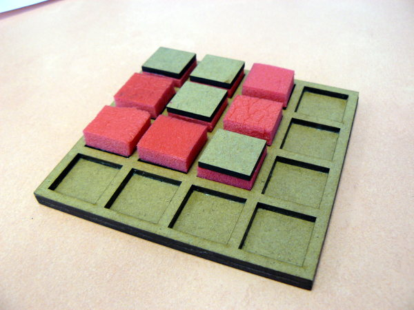
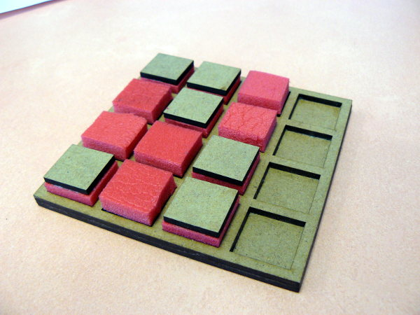
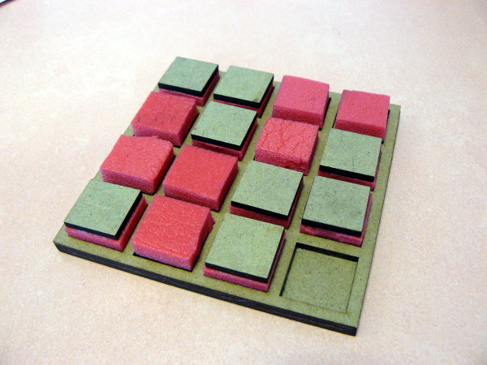
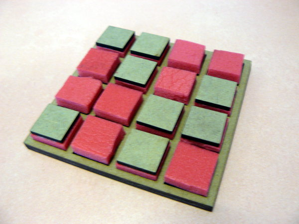
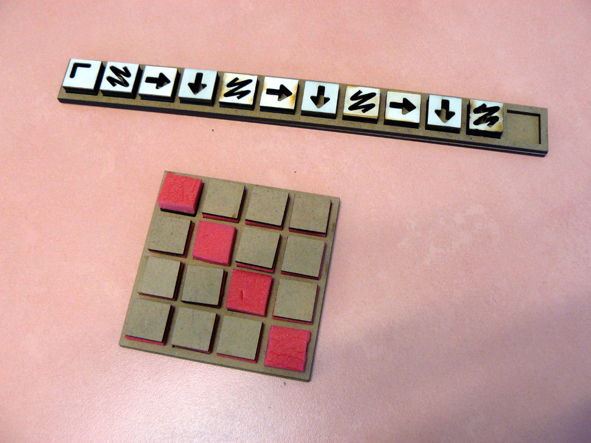
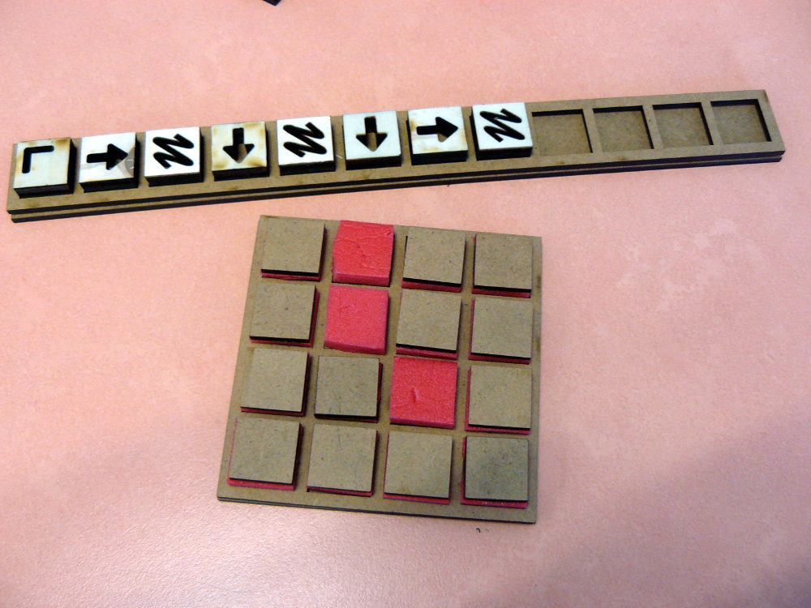

# Informatique sans ordinateur — adaptations pour déficients visuels

L’informatique débranchée ?

Il s’agit de parler d’informatique, de programmation, d’appréhender les concepts qu’il y a derrière, mais sans utiliser d’ordinateur, qui peut faire peur ou détourner l’attention.
Entre autres, jeu du robot idiot, binaire, coder des images, crêpier psychorigide, etc.

L’idée était de réfléchir à comment adapter ces jeux pour les déficients visuels (malvoyant·e·s et non-voyant·e·s). Nous nous sommes intéressés à deux outils en particulier :

* Le jeu du code correcteur d’erreur: un tour de magie qui utilise la parité comme clé de contrôle, ça a l’air barbare mais venez voir, on est de mauvais magiciens on donne notre secret. Cette activité est adaptée depuis l'activité *tour de cartes* proposée par [le groupe de recherche Informatique sans Ordinateur de l'IREM de Clermont-Ferrand](http://www.irem.univ-bpclermont.fr/Informatique-sans-Ordinateur). Vous trouverez sur leur page de la documentation à destination des enseignant·e·s.
* Le jeu des images à relier à un petit code qui sert à « fabriquer l’image ».

Ces deux outils ont certaines cartes en commun (chaque carte a deux faces, ce qui correspond à deux états).

Après différents essais, hop !

## Réflexions et choix

Nous avons travaillé pendant plusieurs séances avec quelques membres des [petits débrouillards](http://lespetitsdebrouillards-aura.org/) de Clermont-Ferrand, et avec des membres du [groupe de recherche Informatique sans Ordinateur de l'IREM de Clermont-Ferrand](http://www.irem.univ-bpclermont.fr/Informatique-sans-Ordinateur), avec quelques personnes en situation de déficience visuelle, afin de prendre en compte à la fois les aspects pédagogiques et d'accessibilité du matériel proposé.

Nous avons ainsi convenu qu'il fallait fabriquer:

* un jeu où les pièces ne pourraient pas bouger par mauvaise manipulation.
* des pièces réversibles, distinguables rapidement au toucher par un matériau différent, afin d'en faciliter la lecture instantanée.
* un plateau d'une taille peu excessive, afin qu'il tienne facilement sous la main.
* un plateau sans distinction des pixels de l'image et des codes correcteurs d'erreur.
* que les symboles en négatif pour les instructions étaient suffisamment lisibles s'ils étaient bien positionnés, et d'une forme lisible. Ainsi, les flèches sont composées de triangles, où la pulpe du doigt peut facilement descendre, les coins sont symbolisés par des équerres proches du bord, mais suffisamment écartées pour que l'on puisse les localiser facilement.

## Fabrication 

Nous avons opté pour une fabrication par découpe laser de planches de bois et de medium, couplés à un matériau en plastique souple (un tapis de sport). Dans notre cas, nous avons utilisé une ARKETYPE Laser Métal 1325 disponible à [SIGMake](https://sigmake.jimdo.com/), et dont le [manuel d'utilisation](https://sigmake.jimdo.com/app/download/12741731136/D%C3%A9coupe+et+Gravure+laser.pdf?t=1512554719) est proposée par l'équipe sur place.

Les fichiers dxf présents sur ce dépôt permettent de piloter une découpeuse laser. Ils ont été conçus à l'aide d'[OpenSCAD](http://www.openscad.org/) et d'[inkscape](http://inkscape.fr/).

## Illustration

### Code correcteur d'erreur 

Le plateau de jeu utilisé pour l'activité tour de cartes :

   

Le plateau de jeu utilisé pour l'activité codage d'images :

 
=======
http://lespetitsdebrouillards-aura.org/event/soiree-3n-informatique-debranchee-et-deficience-visuelle-1/
http://lespetitsdebrouillards-aura.org/event/soiree-3n-informatique-debranchee-et-deficience-visuelle-2/
